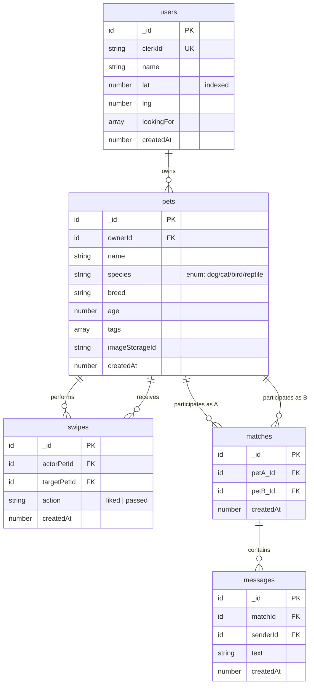
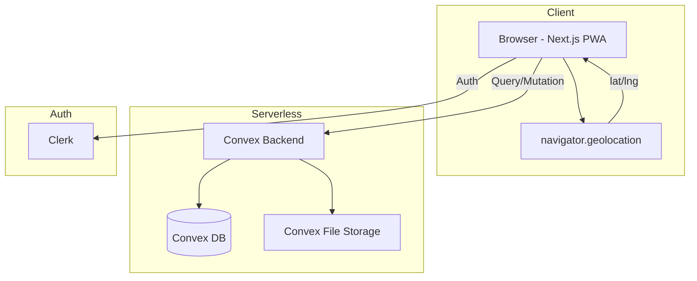

# Sniffari — Integrated Product Spec

**Product Name:** Sniffari
**Internal Repo:** petinder
**Version:** 0.1.0 (MVP)
**Timeline:** 2–4 weeks
**Target Audience:** Pet owners (dogs, cats, birds, reptiles)

---

# Section A: Product Requirements (PRD)

## 1. Overview

| Field | Value |
|-------|-------|
| Product | Sniffari |
| Problem | Pet owners lack an easy, local way to arrange safe platonic playdates for their pets |
| Solution | Mobile-first web app: create a pet profile, swipe on nearby pets, match, and chat |
| Business Goal | Build a community of pet owners arranging local playdates |
| Platform | Mobile-first web (responsive PWA-adjacent) |
| Timeline | MVP in 2–4 weeks |

## 2. Success Metrics

| Metric | Baseline | Target | Measurement |
|--------|----------|--------|-------------|
| Pet profiles created | 0 | 100 in first month | Convex DB count |
| Swipe actions per user/day | 0 | 20 avg | Convex swipes log |
| Match rate | 0% | ≥5% of swipes | matches / total swipes |
| Messages sent per matched pair | 0 | 3+ in first 48h | Convex messages log |

## 3. Scope

### ✅ In-Scope (MVP)
- Email/password auth via Clerk
- Onboarding creates 1 pet; users can add more pets later in settings
- Browse & swipe on nearby pets (right = interested, left = pass)
- Mutual match detection & notification
- Real-time text chat between matched users
- Location capture via `navigator.geolocation`
- Proximity matching via Bounding Box + Haversine (server-side only)
- Species-inclusive UI (dynamic copy based on pet species)
- Soft, playful UI (Sunset orange-pink theme, rounded corners, Tailwind CSS)

### ❌ Out-of-Scope (MVP)
- No social logins (Google/Apple)
- No human profile pictures
- No read receipts or typing indicators
- No paid APIs (Google Maps, Mapbox)
- No complex onboarding branches

## 4. User Flow (Main Journey)

```
Landing → Sign Up (Clerk) → Allow Location → Create Pet Profile → Swipe Deck → Match! → Chat
```

### Edge Cases
- **Location denied:** Show manual zip/city input fallback
- **No pets nearby:** "Expand radius" prompt + species-specific empty state
- **Swipe deck exhausted:** "Come back later" message, suggest radius increase
- **Concurrent match:** Both users swipe right at same time → mutual match triggers once

## 5. User Stories

| ID | User Story | Acceptance Criteria |
|----|------------|-------------------|
| US-01 | As a new user, I want to sign up with email/password so I can access the app | **Given** I'm on the landing page, **when** I click "Sign Up" and enter email+password, **then** I'm authenticated and redirected to location prompt |
| US-02 | As a signed-up user, I want to create a pet profile with name, species, breed, age, tags, and photo so other users can see my pet | **Given** I'm authenticated, **when** I fill in pet details + upload a photo, **then** the profile is saved to Convex and I'm taken to the swipe deck |
| US-03 | As a user with a pet profile, I want to see nearby pets one at a time and swipe right (interested) or left (pass) | **Given** I have a pet profile, **when** I view the swipe deck, **then** I see one pet card at a time with name, photo, breed, age, tags; swiping right records "liked", left records "passed" |
| US-04 | As a user, I want to be notified when a mutual match occurs so I can start chatting | **Given** I swiped right on a pet, **when** that pet's owner also swipes right on me, **then** both users see a "It's a Match!" animation and a new chat thread opens |
| US-05 | As a matched user, I want to send and receive real-time text messages so I can arrange a playdate | **Given** I have a match, **when** I send a message, **then** the matched user sees it in real-time in the chat thread |

## 6. Open Questions

| # | Question | Status |
|---|----------|--------|
| OQ-01 | Image upload — Convex storage or external (Cloudinary/Uploadthing)? | TBD |
| OQ-02 | Minimum age requirement for users? | TBD |
| OQ-03 | Default search radius in km/miles? | TBD (suggest 25km) |

---

# Section B: Functional Specification (FSD)

## 1. System Architecture

- **Frontend:** Next.js 16 (App Router) + React 19 + Tailwind CSS v4
- **Animations:** Framer Motion (swipe physics, match celebration)
- **Backend & DB:** Convex (TypeScript) — serverless functions, real-time sync, relational document store
- **Auth:** Clerk (Email/Password only)
- **Image Storage:** Convex File Storage (MVP) or Uploadthing
- **Deployment:** Vercel (frontend) + Convex (backend)

## 2. Global Business Rules

| ID | Rule |
|----|------|
| BR-001 | Onboarding creates 1 pet; users can add more pets later in settings |
| BR-002 | All geospatial distance calculations run on Convex server — NEVER client-side |
| BR-003 | Location is captured once during onboarding (re-capturable in settings) |
| BR-004 | Swipe action is final: no "rewind" in MVP |
| BR-005 | A match is created iff both parties swiped "liked" on each other |
| BR-006 | Chat is only available between matched pairs |

## 3. Detailed Functional Flows

### 3.1 Location Capture

```
1. User clicks "Allow Location"
2. navigator.geolocation.getCurrentPosition() fires
3. Success → lat/lng stored in users.lat, users.lng on Convex
4. Failure/Denied → show manual zip-code input → zip-to-lat/lng lookup via static table in Convex
5. Proceed to Pet Profile creation
```

### 3.2 Swipe Engine

```
1. Fetch candidate pets from Convex:
   a. Bounding Box query: WHERE lat BETWEEN @minLat AND @maxLat
      AND lng BETWEEN @minLng AND @maxLng
      AND species IN user.lookingFor
      AND NOT id IN (SELECT targetPetId FROM swipes WHERE actorPetId = user.pet.id)
   b. Load results into memory
   c. Apply Haversine filter: keep only pets within user's specified radius
   d. Return filtered list to client
2. User swipes right:
   a. Insert swipes { actorPetId, targetPetId, action: "liked" }
   b. Check for mutual: if swipes EXISTS where actorPetId=targetPetId AND targetPetId=actorPetId AND action="liked"
   c. If mutual → insert matches { petA_Id, petB_Id } → trigger match notification
3. User swipes left:
   a. Insert swipes { actorPetId, targetPetId, action: "passed" }
```

### 3.3 Real-time Chat

```
1. User opens chat → Convex subscription on messages WHERE matchId = X
2. User sends message → Convex mutation: insert messages { matchId, senderId, text, createdAt }
3. Subscription fires → both users receive new message in real-time
```

## 4. Validation Rules

| Field | Rules |
|-------|-------|
| Pet Name | Required, 2–50 chars, trimmed |
| Species | Required, enum: dog, cat, bird, reptile |
| Breed | Required, 2–50 chars |
| Age | Required, integer 0–50 |
| Tags | Max 5, each 2–30 chars, lowercase |
| Photo | Required, max 5MB, jpg/png/webp |
| Location | Required, lat ±90, lng ±180 |

## 5. UI States (per screen)

| Screen | Loading | Empty | Error | Success |
|--------|---------|-------|-------|---------|
| Swipe Deck | Skeleton card with shimmer | "No pets nearby — expand radius?" with illustration | "Couldn't load pets — tap to retry" | Pet card with image + details |
| Chat List | Spinner | "No matches yet — keep swiping!" | "Failed to load chats" | List of matched pets |
| Chat Thread | Spinner | "Send a message to start the conversation!" | "Couldn't load messages — tap to retry" | Message bubbles in real-time |

## 6. Data Dictionary

### users
| Field | Type | Required | Description |
|-------|------|----------|-------------|
| _id | id | PK | Convex auto-ID |
| clerkId | string | Y | Clerk user ID (unique index) |
| name | string | Y | User's display name |
| lat | number | Y | Latitude (indexed for bounding box) |
| lng | number | Y | Longitude |
| lookingFor | string[] | Y | Array of accepted species |
| createdAt | number | Y | Unix timestamp |

### pets
| Field | Type | Required | Description |
|-------|------|----------|-------------|
| _id | id | PK | Convex auto-ID |
| ownerId | id | Y FK->users | Pet's owner |
| name | string | Y | Pet's name |
| species | string | Y | Enum: dog/cat/bird/reptile |
| breed | string | Y | Breed name |
| age | number | Y | Age in years |
| tags | string[] | N | Interest tags |
| imageStorageId | string | N | Convex File Storage ID |
| createdAt | number | Y | Unix timestamp |

### swipes
| Field | Type | Required | Description |
|-------|------|----------|-------------|
| _id | id | PK | Convex auto-ID |
| actorPetId | id | Y FK->pets | Pet that performed the swipe |
| targetPetId | id | Y FK->pets | Pet that was swiped on |
| action | string | Y | "liked" or "passed" |
| createdAt | number | Y | Unix timestamp |

### matches
| Field | Type | Required | Description |
|-------|------|----------|-------------|
| _id | id | PK | Convex auto-ID |
| petA_Id | id | Y FK->pets | First pet in match |
| petB_Id | id | Y FK->pets | Second pet in match |
| createdAt | number | Y | Unix timestamp |

### messages
| Field | Type | Required | Description |
|-------|------|----------|-------------|
| _id | id | PK | Convex auto-ID |
| matchId | id | Y FK->matches | Match this message belongs to |
| senderId | id | Y FK->users | Sender's user ID |
| text | string | Y | Message content |
| createdAt | number | Y | Unix timestamp |

## 7. Business Rules Catalog

| ID | Rule | Applies To | Validation |
|----|------|------------|-----------|
| BR-001 | Onboarding creates 1 pet; users can add more later | pets | No hard limit; at least 1 required to swipe |
| BR-002 | Server-side geospatial only | swipes | Bounding Box + Haversine in Convex query |
| BR-003 | No duplicate swipes | swipes | Unique constraint on (actorPetId, targetPetId) |
| BR-004 | No self-swiping | swipes | actorPetId != targetPetId |
| BR-005 | Mutual match once | matches | Check before inserting new match row |
| BR-006 | Chat only for matched pairs | messages | matchId must exist in matches; senderId must be owner of petA_Id or petB_Id |

## 8. Entity Relationship Diagram



---

# Section C: Tech Stack & Architecture

## 1. Technology Decisions

| Layer | Choice | Alternatives | Why This Choice |
|-------|--------|--------------|-----------------|
| Frontend | Next.js 16 + React 19 | Remix, SvelteKit | App Router, server/client components, huge ecosystem |
| Styling | Tailwind CSS v4 | styled-components, vanilla CSS | Utility-first, fast iteration, mobile-first |
| Animation | Framer Motion | CSS transitions, react-spring | Swipe physics, drag handling, match celebration |
| Backend & DB | Convex (TypeScript) | Supabase, Firebase, custom backend | Real-time sync built-in, serverless TS, no schema migrations |
| Auth | Clerk (Email/Password) | Supabase Auth, NextAuth v5 | Best DX with Next.js, built-in email magic links |
| Image Storage | Convex File Storage | Cloudinary, Uploadthing | All-in-one with Convex, simple API |
| Deployment | Vercel | Railway, self-hosted | Optimal Next.js support, free tier |

## 2. Architecture Diagram



## 3. Key Architecture Decisions (ADRs)

### ADR-001: Convex over Supabase
- **Context:** Need real-time sync for chat + match detection
- **Decided:** Convex — real-time is native, no WebSocket setup
- **Consequence:** Vendor lock-in to Convex ecosystem; no raw SQL access

### ADR-002: Server-side Haversine only
- **Context:** No paid geolocation APIs; need privacy + accuracy
- **Decided:** Two-step filter (Bounding Box index scan → Haversine in-memory)
- **Consequence:** Not as accurate as PostGIS/GeoJSON at scale, fine for MVP volume

### ADR-003: Onboarding creates 1 pet, but multi-pet supported
- **Context:** Keep onboarding linear while allowing multi-pet in settings
- **Decided:** No DB-level limit; UI enforces onboarding creates at least 1; user can add more via settings
- **Consequence:** Swipe deck must let user select which pet to swipe as (future work); MVP uses the only pet

## 4. Development Environment

| Tool | Version | Notes |
|------|---------|-------|
| Node.js | 20+ | Required by Next.js 16 |
| bun | latest | Package manager |
| Convex CLI | latest | `npx convex dev` for local backend |
| Clerk Account | Free tier | API keys in `.env.local` |

### Environment Variables
```
NEXT_PUBLIC_CLERK_PUBLISHABLE_KEY=
CLERK_SECRET_KEY=
NEXT_PUBLIC_CONVEX_URL=
CONVEX_DEPLOYMENT=
```

---

# Section D: Execution Plan

## Definition of Done
- [ ] Auth flow (signup, login, logout) via Clerk works
- [ ] Location capture (geolocation or manual) stores lat/lng in Convex
- [ ] Pet profile CRUD with image upload works
- [ ] Swipe deck renders local pets within radius (Bounding Box + Haversine)
- [ ] Right swipe → liked; left swipe → passed; recorded in Convex
- [ ] Mutual match detection triggers celebration animation
- [ ] Real-time chat between matched pairs works
- [ ] Species-inclusive UI (dynamic copy, no dog-only puns)
- [ ] Mobile-first responsive layout with Sunset (orange-pink) theme
- [ ] All MVP features deployed on Vercel + Convex

## Task Checklist

- [ ] **T-01: Project Scaffold & Dependencies**
  - Install Convex, Clerk, Framer Motion, Convex CLI
  - Configure Convex dev server, Clerk providers
  - Set up `.env.local` with Clerk + Convex keys
  - Configure Tailwind v4 with sunset orange-pink theme tokens

- [ ] **T-02: Convex Schema & Backend**
  - Define schema (users, pets, swipes, matches, messages)
  - Implement queries: getCandidates (Bounding Box + Haversine), getMatches, getMessages
  - Implement mutations: createPet, recordSwipe, createMatch, sendMessage
  - Seed zip-code-to-lat/lng lookup table (static data)

- [ ] **T-03: Auth Pages & Middleware**
  - Clerk `<ClerkProvider>` + `<SignedIn>`/`<SignedOut>` wrappers
  - Sign In / Sign Up pages (Clerk `<SignIn>` / `<SignUp>` components)
  - Middleware to protect `/swipe`, `/chats`, `/profile` routes

- [ ] **T-04: Onboarding Flow**
  - Location capture page (HTML5 geolocation with manual fallback)
  - Pet profile creation form (name, species, breed, age, tags, photo upload)
  - Redirect to swipe deck on completion

- [ ] **T-05: Swipe Deck UI**
  - Fetch candidates from Convex query
  - Framer Motion drag card with swipe right/left detection
  - Card: pet photo, name, breed, age, species-badged tags
  - Species-adaptive copy (e.g., "Play?" for dogs, "Chirp?" for birds)
  - Empty state / exhausted deck handling

- [ ] **T-06: Match Detection & Celebration**
  - Check mutual match on each "liked" swipe
  - "It's a Match!" modal with Framer Motion confetti/stars animation
  - Navigate to chat thread or continue swiping

- [ ] **T-07: Real-time Chat**
  - Match list page with latest message preview
  - Chat thread with Convex subscription for real-time messages
  - Message bubble UI (sent / received styling)
  - Species-adaptive empty state ("No matches yet!")

- [ ] **T-08: Profile, Settings & Multi-Pet**
  - View / edit pet profiles
  - Add new pet
  - Re-capture location
  - Update "looking for" species preferences
  - Logout

- [ ] **T-09: Polish & Deploy**
  - Mobile-responsive QA (320px–768px viewports)
  - Loading skeletons for all screens
  - Error boundaries + retry buttons
  - Build + lint pass
  - Deploy to Vercel + Convex production
